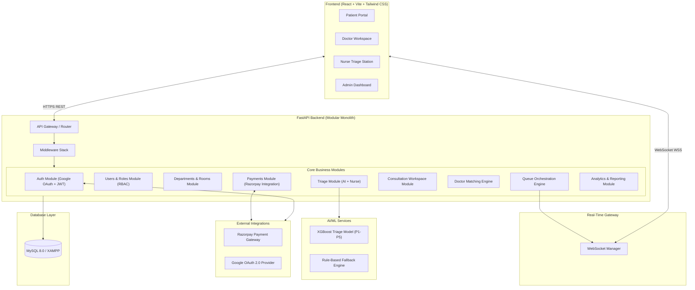

# MediFlow AI — Architecture Specification

## Overview

MediFlow AI is an AI-powered patient-doctor matching and hospital queue management system built with a Clean Architecture / Modular Monolith design pattern.

## Module Breakdown

1. **Auth Module**: Google OAuth 2.0 code exchange, JWT access & refresh token generation, staff email invitation handling.
2. **Users Module**: Role-Based Access Control (Patient, Doctor, Nurse, Admin, Super Admin) with auto-profile creation.
3. **Queue Orchestration Engine**: Manages check-in, priority calculation (0-100 score based on triage P1-P5 + pain scale), queue position assignment, patient calling, room assignment, and status transitions.
4. **Triage Engine**: Nurse vitals assessment integrated with an XGBoost classifier predicting ESI triage levels P1-P5 with SHAP explainability and rule-based keyword fallback.
5. **Doctor Matching Engine**: Multi-factor scoring algorithm evaluating:
   - Specialty match fit (40 pts)
   - Doctor current workload (25 pts)
   - Rating score (20 pts)
   - Availability schedule (15 pts)
6. **Consultation Workspace Module**: Doctor clinical interface for diagnosis, clinical notes, treatment plans, vital sign recording, prescriptions, and instant invoice generation.
7. **Razorpay Payments Module**: Handles invoice creation, Razorpay order generation, HMAC SHA256 signature verification, webhook processing (`payment.captured`, `payment.failed`), and refunds.
8. **Real-Time Layer**: WebSocket channel manager enabling department-level queue broadcasts and instant patient notification popups.
