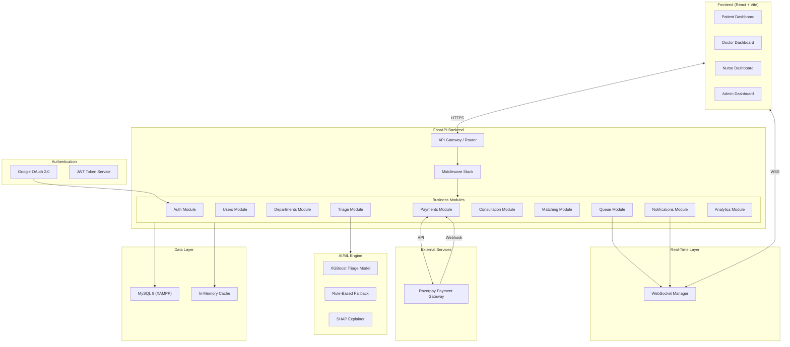
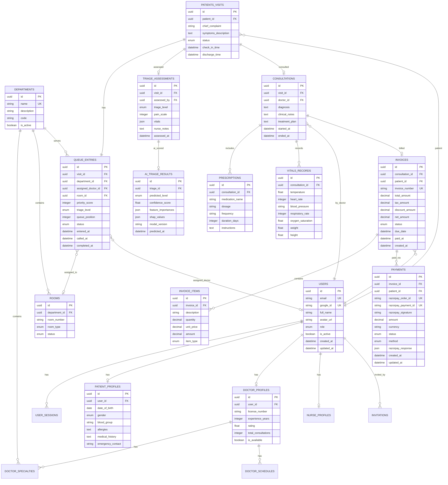
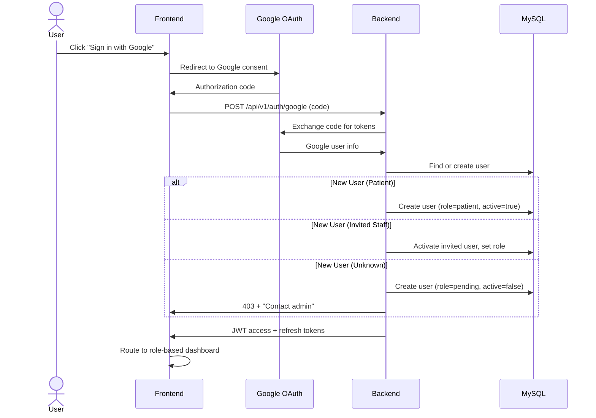
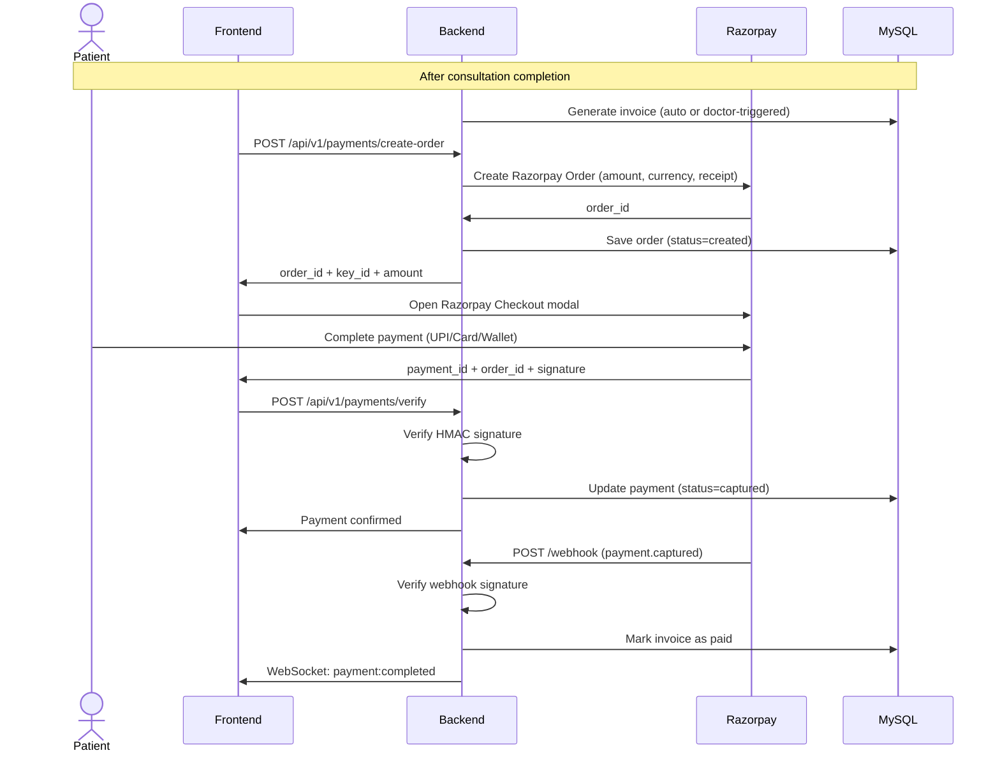

# MediFlow AI — Implementation Plan

AI-powered patient-doctor matching and hospital queue management system. This plan covers the complete production-ready architecture: FastAPI backend, React+Vite frontend, MySQL database (XAMPP), XGBoost triage AI, and real-time WebSocket queue orchestration.

---

## User Review Required

> [!IMPORTANT]
> **Google OAuth Credentials**: You will need to create a Google Cloud project with OAuth 2.0 credentials (Client ID + Client Secret). The app will work with mock auth in development mode until real credentials are provided.

> [!IMPORTANT]
> **XAMPP MySQL**: The application assumes MySQL is running via XAMPP on `localhost:3306` with root user and no password (default XAMPP config). Confirm this matches your setup.

> [!WARNING]
> **AI Model Training Data**: The XGBoost triage model will ship with a synthetic training dataset for the hackathon. For production, real clinical data is required for accurate triage scoring.

> [!IMPORTANT]
> **Razorpay Credentials**: The payment module requires `RAZORPAY_KEY_ID` and `RAZORPAY_KEY_SECRET`. The app will run in **test/sandbox mode** until real credentials are provided. You mentioned you'll share the API keys later — the system will use mock payment flows in development.

---

## Open Questions

None remaining — all blocking questions were resolved via the interactive questionnaire. The following **assumptions** are documented below.

---

## Assumptions

| # | Assumption | Impact |
|---|-----------|--------|
| 1 | XAMPP MySQL runs on `localhost:3306`, user `root`, no password | Database connectivity |
| 2 | Single-hospital deployment for MVP (multi-tenant architecture designed but single tenant active) | Data model scope |
| 3 | Patients describe symptoms via text input; AI parses and classifies | UX flow |
| 4 | Doctors set their own availability schedule; admin can override | Scheduling logic |
| 5 | Queue positions update in real-time via WebSocket for all connected clients | Infrastructure |
| 6 | Prescriptions are text-based records (no e-prescription integration for MVP) | Feature scope |
| 7 | Razorpay payment in test/sandbox mode until real keys provided | Payment scope |
| 8 | English language only for MVP | i18n scope |

---

## Requirements Analysis

### Functional Requirements (MoSCoW)

#### MUST HAVE
- Google OAuth login with role-based routing
- Patient self-registration; staff invited by admin via email
- Patient symptom submission with AI triage (P1–P5 urgency)
- AI-powered doctor matching (specialty + urgency + workload + rating)
- Real-time queue with priority ordering and position updates
- Full queue orchestration: check-in → triage → room assignment → doctor handoff → consultation → discharge
- Doctor consultation workspace (notes, vitals, prescriptions, diagnosis)
- Patient history view for doctors
- Nurse triage station (vitals entry, initial assessment)
- Role-based dashboards (Patient, Doctor, Nurse, Admin)
- Admin: manage users, departments, rooms, view analytics
- WebSocket real-time updates for queue changes
- Razorpay payment integration: consultation fees, billing, receipts
- Invoice generation after consultation completion

#### SHOULD HAVE
- Estimated wait time calculation
- Doctor availability/schedule management
- Department-level queue views
- Patient notification (in-app) for queue status changes
- Admin analytics dashboard (daily volume, avg wait, dept load)
- SHAP-based explainability for AI triage decisions

#### NICE TO HAVE
- SMS/email notifications for queue updates
- Patient feedback/rating after consultation
- Dark mode UI
- Payment analytics (revenue reports, outstanding bills)
- Mobile-responsive tablet view for nurse stations

#### FUTURE
- Multi-hospital/multi-tenant deployment
- FHIR resource export
- Lab order integration
- Telemedicine video consultation
- Mobile native app (React Native)

### Non-Functional Requirements
- **Performance**: API p95 < 200ms, WebSocket update latency < 100ms
- **Security**: OWASP Top 10 mitigations, HTTPS, secure headers, RBAC
- **Accessibility**: WCAG 2.1 AA compliance
- **Scalability**: Designed for 100K users, MVP handles ~100 concurrent
- **Availability**: Graceful degradation if AI service is unavailable (fallback to rule-based triage)

---

## Architecture Decision

### Chosen: **Modular Monolith (Clean Architecture)**

**Why not microservices?**
- Single team / hackathon timeline
- Low budget (open-source only)
- XAMPP MySQL = single database server
- Microservices add operational complexity without proportional benefit at this scale

**Why modular monolith?**
- Clear module boundaries (auth, queue, triage, consultation) allow future extraction to services
- Single deployment unit simplifies Docker/XAMPP dev workflow
- Clean Architecture layers enforce separation of concerns
- Can scale to 100K users with connection pooling + async I/O

**Modules:**
1. `auth` — Google OAuth, JWT, RBAC
2. `users` — User management, profiles, invitations
3. `departments` — Medical departments, specialties
4. `queue` — Queue orchestration, room assignment, priority management
5. `triage` — AI triage engine (XGBoost + rule-based fallback)
6. `consultation` — Doctor workspace, notes, vitals, prescriptions
7. `matching` — Patient-doctor matching algorithm
8. `payments` — Razorpay billing, invoices, refunds
9. `notifications` — In-app real-time notifications
10. `analytics` — Dashboard metrics and reporting

---

## System Architecture Diagram



---

## Technology Stack

| Layer | Technology | Why |
|-------|-----------|-----|
| Frontend | React 18 + Vite 5 | Fast HMR, modern build tooling |
| Styling | Tailwind CSS v3 + shadcn/ui inspired components | Rapid UI dev, healthcare-grade aesthetics |
| State (Server) | TanStack Query v5 | Cache, sync, dedupe server state |
| State (Client) | Zustand | Lightweight, no boilerplate |
| Real-Time | Native WebSocket + custom hooks | Low-latency queue updates |
| Backend | FastAPI 0.115+ | Async Python, auto OpenAPI docs, Pydantic v2 |
| ORM | SQLAlchemy 2.0 | Async support, mature MySQL adapter |
| Migrations | Alembic | SQLAlchemy-native migration tool |
| Auth | Google OAuth 2.0 + python-jose JWT | Industry standard, secure |
| Database | MySQL 8.0 (XAMPP) | Specified requirement |
| AI/ML | XGBoost + scikit-learn + SHAP | Best-in-class tabular ML, explainability |
| NLP | sentence-transformers (MiniLM) | Lightweight symptom text embedding |
| Payments | Razorpay (razorpay Python SDK) | Indian payment gateway, UPI/cards/wallets, low fees |
| Testing | pytest + Vitest + Playwright | Full stack coverage |
| Containerization | Docker + Docker Compose | Reproducible environments |
| CI/CD | GitHub Actions | Free for open-source |

---

## Database ER Diagram



---

## Proposed Changes

### Phase 1 — Project Foundation & Configuration

#### [NEW] Root project files
- `docker-compose.yml` — MySQL + backend + frontend services
- `docker-compose.dev.yml` — Development overrides
- `.env.example` — All environment variables documented
- `.gitignore` — Python, Node, IDE, env files
- `README.md` — Setup and run instructions
- `Makefile` — Common commands (dev, test, migrate, seed)

---

### Phase 2 — Backend Foundation

#### [NEW] `backend/` — FastAPI application

```
backend/
├── app/
│   ├── __init__.py
│   ├── main.py                    # FastAPI app factory
│   ├── core/
│   │   ├── config.py              # Pydantic Settings
│   │   ├── security.py            # JWT, password hashing
│   │   ├── dependencies.py        # DB session, current user
│   │   ├── exceptions.py          # Custom exception classes
│   │   └── middleware.py          # CORS, request ID, logging
│   ├── db/
│   │   ├── base.py                # SQLAlchemy Base
│   │   ├── session.py             # Engine, SessionLocal
│   │   └── init_db.py             # DB initialization
│   ├── models/                    # SQLAlchemy ORM models
│   │   ├── user.py
│   │   ├── patient.py
│   │   ├── doctor.py
│   │   ├── nurse.py
│   │   ├── department.py
│   │   ├── room.py
│   │   ├── visit.py
│   │   ├── queue.py
│   │   ├── triage.py
│   │   ├── consultation.py
│   │   ├── prescription.py
│   │   ├── vitals.py
│   │   ├── invoice.py
│   │   └── payment.py
│   ├── schemas/                   # Pydantic request/response
│   │   ├── user.py
│   │   ├── auth.py
│   │   ├── patient.py
│   │   ├── doctor.py
│   │   ├── queue.py
│   │   ├── triage.py
│   │   ├── consultation.py
│   │   ├── payment.py
│   │   └── common.py
│   ├── routers/                   # API route handlers
│   │   ├── auth.py
│   │   ├── users.py
│   │   ├── patients.py
│   │   ├── doctors.py
│   │   ├── departments.py
│   │   ├── rooms.py
│   │   ├── queue.py
│   │   ├── triage.py
│   │   ├── consultation.py
│   │   ├── payments.py
│   │   ├── analytics.py
│   │   └── health.py
│   ├── services/                  # Business logic
│   │   ├── auth_service.py
│   │   ├── user_service.py
│   │   ├── queue_service.py
│   │   ├── triage_service.py
│   │   ├── matching_service.py
│   │   ├── consultation_service.py
│   │   ├── payment_service.py       # Razorpay integration
│   │   └── analytics_service.py
│   ├── ml/                        # AI/ML engine
│   │   ├── triage_model.py        # XGBoost triage classifier
│   │   ├── matching_engine.py     # Doctor matching algorithm
│   │   ├── symptom_parser.py      # NLP symptom extraction
│   │   ├── train.py               # Model training script
│   │   ├── data/
│   │   │   └── synthetic_triage.csv
│   │   └── models/
│   │       └── .gitkeep
│   └── websocket/
│       ├── manager.py             # WebSocket connection manager
│       └── events.py              # Event types and handlers
├── alembic/
│   ├── alembic.ini
│   ├── env.py
│   └── versions/
├── tests/
│   ├── conftest.py
│   ├── test_auth.py
│   ├── test_queue.py
│   ├── test_triage.py
│   └── test_matching.py
├── scripts/
│   ├── seed.py
│   └── train_model.py
├── requirements.txt
├── Dockerfile
└── pyproject.toml
```

---

### Phase 3 — Frontend Foundation

#### [NEW] `frontend/` — React + Vite application

```
frontend/
├── public/
│   └── favicon.svg
├── src/
│   ├── main.jsx
│   ├── App.jsx
│   ├── index.css                  # Tailwind + custom design system
│   ├── assets/
│   │   └── logo.svg
│   ├── components/
│   │   ├── ui/                    # Reusable primitives
│   │   │   ├── Button.jsx
│   │   │   ├── Card.jsx
│   │   │   ├── Badge.jsx
│   │   │   ├── Modal.jsx
│   │   │   ├── Input.jsx
│   │   │   ├── Select.jsx
│   │   │   ├── Table.jsx
│   │   │   ├── Spinner.jsx
│   │   │   ├── Toast.jsx
│   │   │   └── Avatar.jsx
│   │   ├── layout/
│   │   │   ├── AppShell.jsx       # Sidebar + header + main
│   │   │   ├── Sidebar.jsx
│   │   │   ├── Header.jsx
│   │   │   └── MobileNav.jsx
│   │   ├── auth/
│   │   │   ├── GoogleLoginButton.jsx
│   │   │   ├── ProtectedRoute.jsx
│   │   │   └── RoleGuard.jsx
│   │   ├── queue/
│   │   │   ├── QueueBoard.jsx
│   │   │   ├── QueueCard.jsx
│   │   │   ├── QueueTimer.jsx
│   │   │   └── QueueStats.jsx
│   │   └── common/
│   │       ├── EmptyState.jsx
│   │       ├── ErrorState.jsx
│   │       ├── LoadingState.jsx
│   │       └── StatusBadge.jsx
│   ├── features/
│   │   ├── patient/
│   │   │   ├── PatientDashboard.jsx
│   │   │   ├── SymptomForm.jsx
│   │   │   ├── QueueStatus.jsx
│   │   │   └── VisitHistory.jsx
│   │   ├── doctor/
│   │   │   ├── DoctorDashboard.jsx
│   │   │   ├── PatientQueue.jsx
│   │   │   ├── ConsultationWorkspace.jsx
│   │   │   ├── VitalsForm.jsx
│   │   │   ├── PrescriptionForm.jsx
│   │   │   └── PatientHistory.jsx
│   │   ├── nurse/
│   │   │   ├── NurseDashboard.jsx
│   │   │   ├── TriageStation.jsx
│   │   │   ├── VitalsEntry.jsx
│   │   │   └── PatientCheckIn.jsx
│   │   ├── payment/
│   │   │   ├── PaymentPage.jsx          # Razorpay checkout
│   │   │   ├── InvoiceView.jsx          # Invoice detail + PDF
│   │   │   ├── PaymentHistory.jsx       # Patient payment list
│   │   │   └── PaymentSuccess.jsx       # Post-payment confirmation
│   │   ├── admin/
│   │   │   ├── AdminDashboard.jsx
│   │   │   ├── UserManagement.jsx
│   │   │   ├── DepartmentManager.jsx
│   │   │   ├── RoomManager.jsx
│   │   │   ├── InviteStaff.jsx
│   │   │   ├── BillingManagement.jsx    # Admin billing overview
│   │   │   └── AnalyticsPanel.jsx
│   │   └── auth/
│   │       ├── LoginPage.jsx
│   │       └── PendingApproval.jsx
│   ├── hooks/
│   │   ├── useAuth.js
│   │   ├── useWebSocket.js
│   │   ├── useQueue.js
│   │   └── useNotifications.js
│   ├── services/
│   │   ├── api.js                 # Axios instance + interceptors
│   │   ├── authService.js
│   │   ├── queueService.js
│   │   ├── triageService.js
│   │   ├── consultationService.js
│   │   ├── paymentService.js
│   │   └── adminService.js
│   ├── store/
│   │   ├── authStore.js           # Zustand auth state
│   │   ├── queueStore.js          # Zustand queue state
│   │   └── uiStore.js             # Sidebar, modals, toasts
│   ├── utils/
│   │   ├── constants.js
│   │   ├── formatters.js
│   │   └── validators.js
│   └── router.jsx                 # React Router with role guards
├── index.html
├── vite.config.js
├── tailwind.config.js
├── postcss.config.js
├── package.json
└── Dockerfile
```

---

### Phase 4 — AI/ML Engine

#### [NEW] `backend/app/ml/` — Triage + Matching

| Component | Description |
|-----------|------------|
| `triage_model.py` | XGBoost classifier: symptoms + vitals → P1–P5 triage level |
| `matching_engine.py` | Scoring algorithm: specialty fit + workload + rating + availability → ranked doctors |
| `symptom_parser.py` | NLP: free-text symptoms → structured features (body system, severity keywords) |
| `train.py` | Training pipeline with synthetic data, SMOTE, cross-validation |
| `synthetic_triage.csv` | 5,000 synthetic patient records for hackathon training |

**AI Safety Controls:**
- Confidence threshold: predictions below 0.6 confidence flagged for nurse review
- Rule-based fallback: if ML service fails, ESI-based rules handle triage
- SHAP explainability: every prediction includes top-5 feature contributions
- Human override: nurses can always override AI triage level
- Audit logging: every AI prediction logged with model version

---

### Phase 5 — Real-Time WebSocket Layer

#### [NEW] `backend/app/websocket/` — Queue events

| Event | Direction | Description |
|-------|-----------|------------|
| `queue:update` | Server → Client | Queue position changed |
| `queue:called` | Server → Client | Patient called to room |
| `queue:status_change` | Server → Client | Visit status changed |
| `patient:checked_in` | Server → Client | New patient in queue |
| `room:status_change` | Server → Client | Room availability changed |
| `payment:completed` | Server → Client | Payment confirmed via webhook |
| `notification` | Server → Client | In-app notification |

**Connection model:** Room-based channels per department + per-user personal channel.

---

### Phase 6 — Authentication & Authorization

#### Auth Flow


#### Permissions Matrix

| Resource | Patient | Nurse | Doctor | Admin | Super Admin |
|----------|---------|-------|--------|-------|-------------|
| Own profile | CRUD | CRUD | CRUD | CRUD | CRUD |
| Submit symptoms | ✓ | — | — | — | — |
| View own queue | ✓ | — | — | — | — |
| View dept queue | — | ✓ | ✓ | ✓ | ✓ |
| Triage patient | — | ✓ | ✓ | — | — |
| Assign room | — | ✓ | — | ✓ | ✓ |
| Start consultation | — | — | ✓ | — | — |
| Write prescription | — | — | ✓ | — | — |
| View patient history | own | assigned | assigned | all | all |
| Pay invoice | own | — | — | — | — |
| View own payments | own | — | — | — | — |
| Create invoice | — | — | ✓ | ✓ | ✓ |
| View all payments | — | — | — | ✓ | ✓ |
| Issue refund | — | — | — | ✓ | ✓ |
| Manage users | — | — | — | ✓ | ✓ |
| Manage departments | — | — | — | ✓ | ✓ |
| Manage rooms | — | — | — | ✓ | ✓ |
| Invite staff | — | — | — | ✓ | ✓ |
| View analytics | — | — | own | ✓ | ✓ |
| System config | — | — | — | — | ✓ |

---

### Phase 7 — API Design (Key Endpoints)

```
POST   /api/v1/auth/google              # OAuth login
POST   /api/v1/auth/refresh              # Refresh JWT
POST   /api/v1/auth/logout               # Invalidate session

GET    /api/v1/users/me                  # Current user profile
PUT    /api/v1/users/me                  # Update profile
GET    /api/v1/users                     # List users (admin)
POST   /api/v1/users/invite             # Invite staff (admin)

POST   /api/v1/visits                   # Patient check-in + symptoms
GET    /api/v1/visits/{id}              # Visit details
GET    /api/v1/visits/me/active         # Patient's active visit

POST   /api/v1/triage/{visit_id}        # Nurse triage assessment
GET    /api/v1/triage/{visit_id}/ai     # Get AI triage suggestion

GET    /api/v1/queue                    # Current queue (filtered by role)
GET    /api/v1/queue/department/{id}    # Department queue
PATCH  /api/v1/queue/{id}/call          # Call patient (doctor/nurse)
PATCH  /api/v1/queue/{id}/assign-room   # Assign room
PATCH  /api/v1/queue/{id}/assign-doctor # Assign doctor

GET    /api/v1/matching/{visit_id}      # Get matched doctors

POST   /api/v1/consultations            # Start consultation
PATCH  /api/v1/consultations/{id}       # Update notes/diagnosis
POST   /api/v1/consultations/{id}/complete  # Complete consultation
POST   /api/v1/consultations/{id}/prescriptions  # Add prescription
POST   /api/v1/consultations/{id}/vitals         # Record vitals

GET    /api/v1/departments              # List departments
POST   /api/v1/departments              # Create (admin)
GET    /api/v1/rooms                    # List rooms
POST   /api/v1/rooms                    # Create (admin)

POST   /api/v1/payments/create-order    # Create Razorpay order
POST   /api/v1/payments/verify          # Verify payment signature
POST   /api/v1/payments/webhook         # Razorpay webhook handler
GET    /api/v1/payments/me              # Patient's payment history
GET    /api/v1/payments/{id}            # Payment details
POST   /api/v1/payments/{id}/refund     # Initiate refund (admin)

GET    /api/v1/invoices/{id}            # Invoice details
GET    /api/v1/invoices/me              # Patient's invoices
POST   /api/v1/invoices                 # Generate invoice (doctor/admin)
GET    /api/v1/invoices/{id}/pdf        # Download invoice PDF

GET    /api/v1/analytics/overview       # Dashboard metrics
GET    /api/v1/analytics/queue-stats    # Queue statistics
GET    /api/v1/analytics/department/{id}  # Department metrics
GET    /api/v1/analytics/revenue        # Revenue analytics (admin)

GET    /api/v1/health                   # Health check
GET    /api/v1/health/ready             # Readiness probe
```

---

### Razorpay Payment Flow



**Payment Security:**
- Server-side signature verification using HMAC SHA256
- Webhook signature verification for async payment confirmation
- Razorpay keys never exposed to frontend (only `key_id`, never `key_secret`)
- Idempotent payment processing (duplicate webhook protection)
- All payment events logged for audit trail
- Test/sandbox mode auto-detected from key prefix (`rzp_test_` vs `rzp_live_`)

---

## UI/UX Design System

### Color Palette
| Token | Value | Usage |
|-------|-------|-------|
| `primary` | `#0F766E` (teal-700) | Primary actions, navigation |
| `primary-light` | `#14B8A6` (teal-500) | Hover states, accents |
| `secondary` | `#6366F1` (indigo-500) | Secondary actions |
| `success` | `#22C55E` (green-500) | Success states, available |
| `warning` | `#F59E0B` (amber-500) | Warnings, moderate priority |
| `danger` | `#EF4444` (red-500) | Errors, critical priority |
| `surface` | `#0F172A` (slate-900) | Dark mode background |
| `surface-card` | `#1E293B` (slate-800) | Card backgrounds |
| `surface-hover` | `#334155` (slate-700) | Hover states |
| `text-primary` | `#F8FAFC` (slate-50) | Primary text |
| `text-secondary` | `#94A3B8` (slate-400) | Secondary text |

### Triage Level Colors
| Level | Color | Label |
|-------|-------|-------|
| P1 | `#DC2626` red-600 | Resuscitation |
| P2 | `#F97316` orange-500 | Emergency |
| P3 | `#EAB308` yellow-500 | Urgent |
| P4 | `#22C55E` green-500 | Semi-Urgent |
| P5 | `#3B82F6` blue-500 | Non-Urgent |

### Design: Dark-themed healthcare dashboard with glassmorphism cards, smooth micro-animations, and clinical-grade data density.

---

## Verification Plan

### Automated Tests
```bash
# Backend
cd backend && pytest tests/ -v --cov=app --cov-report=html

# Frontend
cd frontend && npx vitest run

# E2E
cd frontend && npx playwright test
```

### Manual Verification
1. Start XAMPP MySQL → run migrations → seed data
2. Launch backend (`uvicorn`) and frontend (`npm run dev`)
3. Test Google OAuth login flow
4. Test patient symptom submission → AI triage → queue entry
5. Test nurse triage station with vitals entry
6. Test doctor consultation workspace
7. Test real-time queue updates via WebSocket
8. Test Razorpay payment flow (sandbox mode)
9. Test admin user management, billing, and analytics
10. Verify WCAG 2.1 AA with axe-core browser extension

### Build Verification
```bash
docker-compose build
docker-compose up -d
# Verify all services healthy
curl http://localhost:8000/api/v1/health
curl http://localhost:5173
```

---

## Implementation Phases (Build Order)

| Phase | Components | Files |
|-------|-----------|-------|
| 1 | Project scaffold, configs, Docker, env | ~15 files |
| 2 | Database models, migrations, seeds (incl. payment tables) | ~23 files |
| 3 | Auth (Google OAuth + JWT + RBAC) | ~12 files |
| 4 | Core backend: queue, triage, consultation, payments | ~30 files |
| 5 | AI/ML: XGBoost triage + matching engine | ~8 files |
| 6 | WebSocket real-time layer | ~5 files |
| 7 | Frontend foundation: shell, routing, auth, design system | ~25 files |
| 8 | Frontend features: all 4 dashboards + payment pages | ~38 files |
| 9 | Testing suite (incl. payment tests) | ~18 files |
| 10 | Documentation | ~10 files |
| **Total** | | **~184 files** |

> [!NOTE]
> Due to the scale (~165 files), implementation will be delivered in sequential phases. Each phase produces runnable, testable code before the next phase begins.
